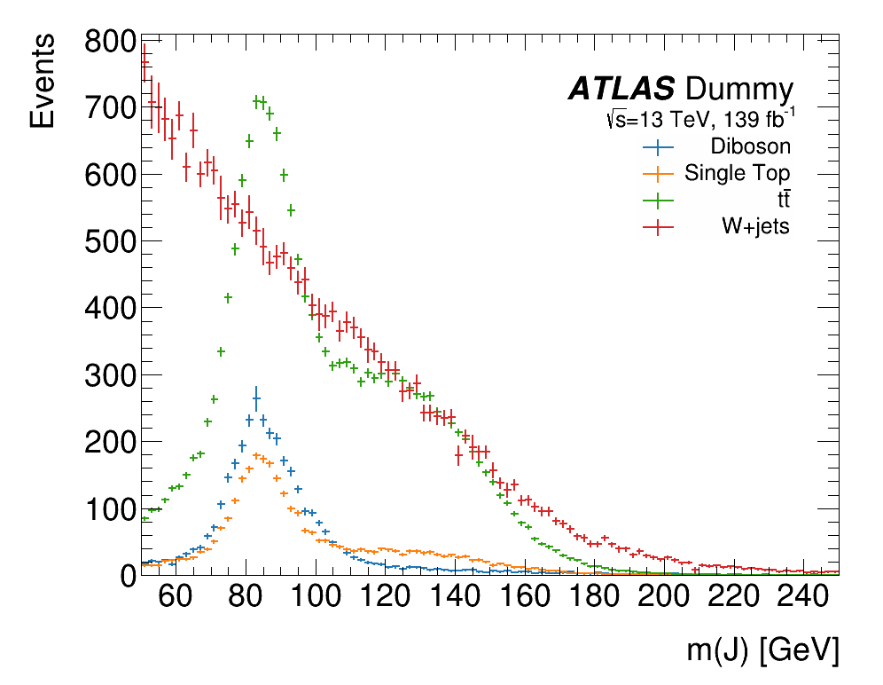
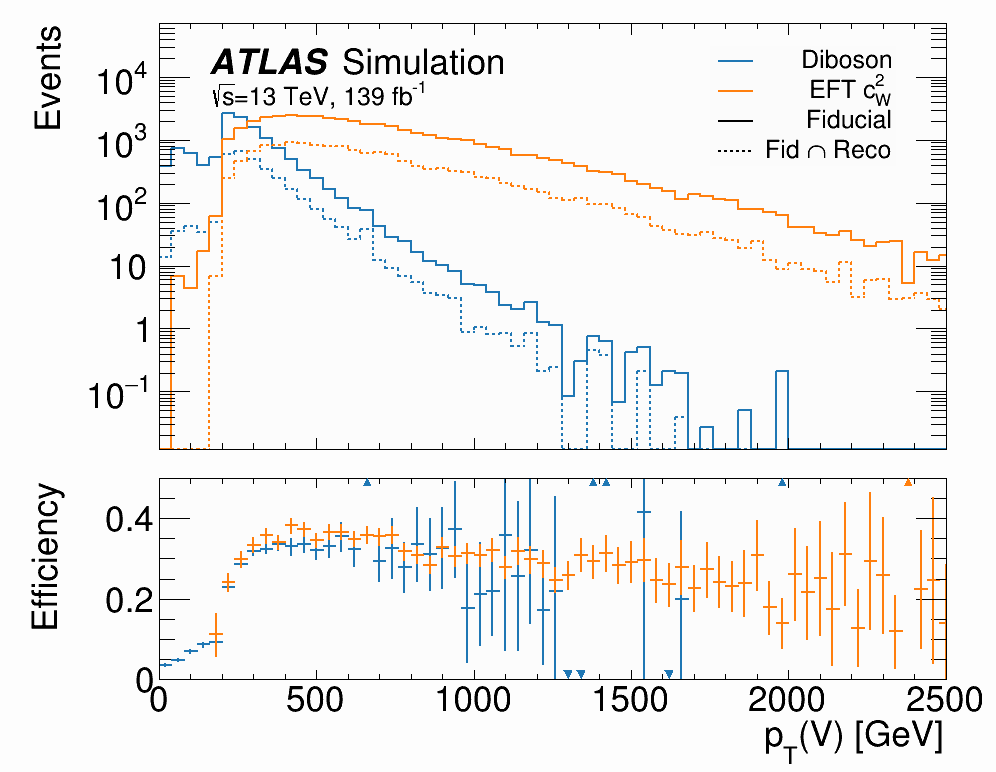
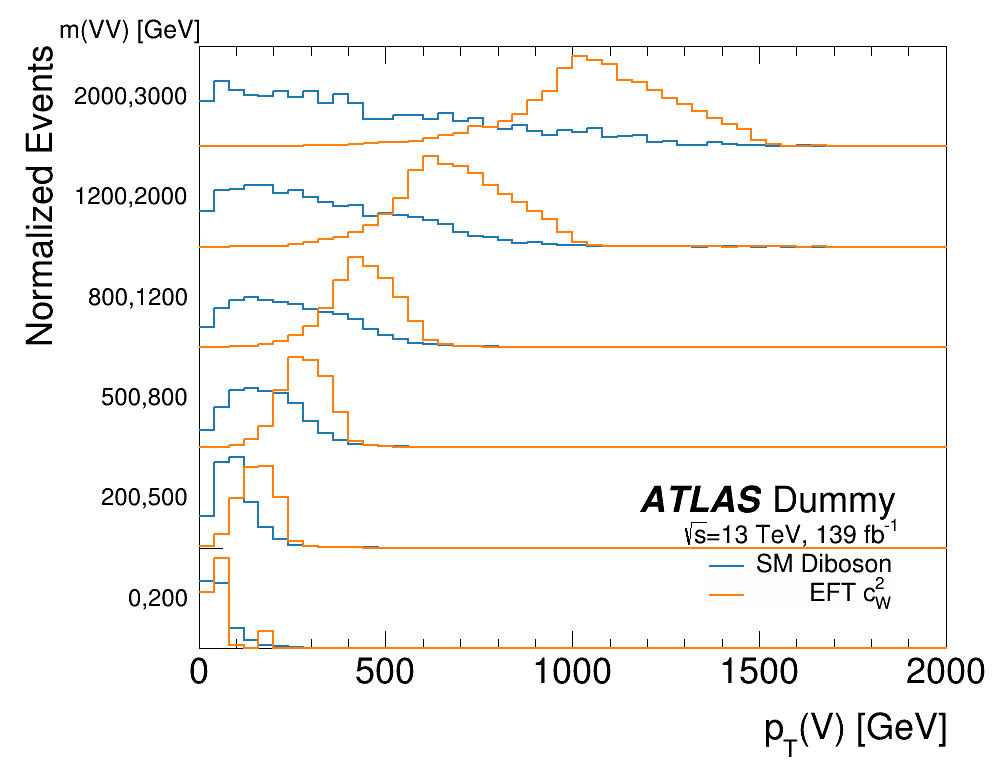

# A Declarative ROOT Plotting Framework

Plotting in ROOT is really annoying. You have to remember to call `"SAME"` everywhere,
axis limits are highly unintuitive, and so on. This module attempts to make ROOT
plotting easier through a declarative syntax. Typical usage would look like:

```py
import plot
plot.plot([h1, h2],                         # plots two histograms in the same canvas
    opts = ['HIST', 'PE'],                  # plot h1 in 'HIST' format and h2 in 'PE' format
    linecolor = plot.colors.tableu,         # sets each histogram's line color using a MPL colormap
    linewidth = 3,                          # applied to both histograms
    subtitle = '#sqrt{s} = 13 TeV^{-1}',    # text options can accept TLatex formatters
    legend = ['Hist 1', 'Hist 2'],
    ytitle = 'Events',
    xtitle = 'm_{T}(W) [GeV]',
    yrange = [0, None],                     # the yrange's upper end will be automatically adjusted to 
                                            # fit all data and ensure the title doesn't overlap the plot
    filename = 'my_plot',
)
```

The input also doesn't have to be all histograms, you can include TF1s and TGraphs too.
In addition, this script takes care of several things missing in ROOT: automatic axis
ranges, automatic legend placement, title text and subtext, etc. It also defines helper
functions to make some common plot types, like ratio plots.

**Please see the docstring in `plot.py` for a full list of functions and options.**

## Installation

Just copy the `plot.py` file to your working directory and call
```py
import plot
```

Alternatively, you can clone/submodule this repo:
```sh
git submodule add git@github.com:riley-x/ROOT_Plotting_Tools.git rplottools
```
And in your python script:
```py
from rplottools import plot
```

## Saving Images

The format of the saved image is inferred by ROOT based on the extension in the filename.
If the extension is omitted, the canvas will be saved for each extension listed in
`plot.file_formats`. This is convenient to save all your plots as both pdfs and pngs by default, 
for example by specifying:
```py
plot.file_formats = ['png', 'pdf']
```
This module can also save transparent pngs, which is enabled by setting
```py
plot.save_transparent = True
```
You will need to have PIL installed.


## Utilities

The `colors` class defines many useful colors and some Matplotlib colormaps, which can be
accessed easily as direct names `plot.colors.blue`, or as indexing functions `plot.colors.tableu(0)`. See the docstring for the class for more info.

A variety of other utility funcitons are also included in this module, such as normalizing histograms
or rebinning a 2D histogram with variable bins.

## Examples

### Basic Plot

[Source](./examples/basic_plot.py). Quick example showing how to style histograms, add title text, and set legend labels.




### Ratio Plot

[Source](./examples/ratio_plot.py). Example with more complicated formatting and legend, with a ratio subplot.




### Discrete Plot

[Source](./examples/discrete_plot.py). This script showcases both `plot_discrete_bins()`, which plots histograms discretized in equal-width bins, and `plot_ratio3()`, which adds two subplots beneath the main plot.


### Tiered Plot

[Source](./examples/tiered_plot.py). This script showcases `plot_tiered()`, which plots multiple histograms in several top-to-bottom tiers. This style is useful for comparing multiple distribution shapes without crowding the plot, at the cost of obscuring the relative normalizations.

